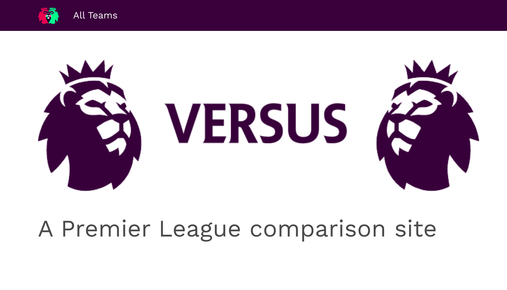
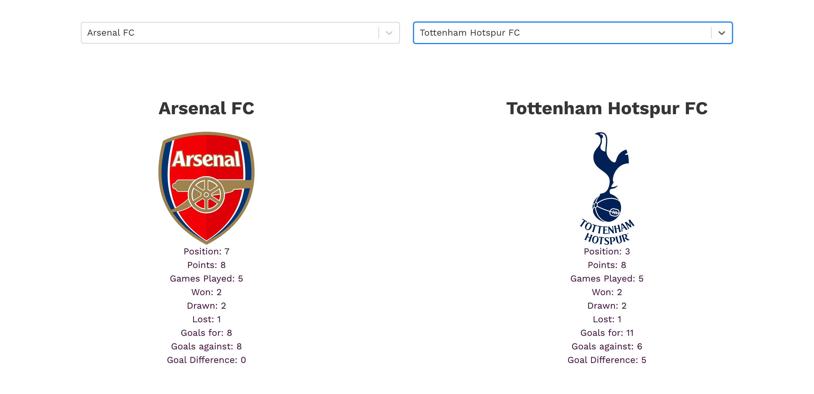

# SEI-Project-2 - Versus

### Timeframe
2 days

### Technologies used

* JavaScript (ES6)
* React
* Webpack
* Ajax
* HTML5
* SCSS
* Insomnia
* Git
* GitHub
* Bulma

### Installation
1. Clone or download the repo
2. Run 'yarn init' in the CLI
3. Run 'yarn serve' in the CLI

### Overview
Working as a pair and sitting at one laptop, our brief was to create and deploy a multi-page React application that consumed at least one third party API and made use of both a classical and a functional component.

### Process
On the first morning of the project we tried to decide on a concept and researched APIs that would be a good fit. When we had settled on the idea of creating a football stats comparison site, we used Trello to create deliverables and define our minimum viable product.

For the next part of the project we focused on getting data from the Football-Data API, mapping over this array, and displaying the data in the form of an index page.

When we had accomplished this we began working on the central part of our app, the club comparison page. The most time-consuming part of the project and the biggest learning curve was creating a React Select component, pre-populating the fields and then displaying the individual club information.

After this was completed we looked at routing our app and creating a navbar component to link the three different pages (home, index, and comparison) together.

In the final two hours of the "hackathon" we focused mainly on styling and creating logos for the home page.

### Challenges

* Time management. We perhaps spent too little time splitting up our minimum viable project into small achievable goals. We also should have spent more time researching third party APIs, since we had to spend a lot of time of destructuring the result of our requests to make it usable. Moreover, the overall standard of free sports data APIs was fairly poor, so some data was simply unavailable.

* The React Select component was something new, which we had not used in classwork prior to the project. Aside from the difficulties mentioned above, it was also awkward to style this component.

### Wins  

* We satisfied all of the key criteria as laid out in the brief and, whilst the API may have been unfriendly, it meant that we gained exposure to more advanced ES6 techniques like destructuring, which we might otherwise have missed.

* Managing a multi-page project for the first time meant that we had to separate concerns across different folders and components within these.

* It was also our first time using SCSS and creating variables.

### Future features

* With more time it would be nice to create a player comparison page and to reference this page on the team comparison page and vice versa.

* It would be good to add more styling, in particular to try to tweak some of the Bulma mobile presets to make the comparison page more effective on smaller screens.
